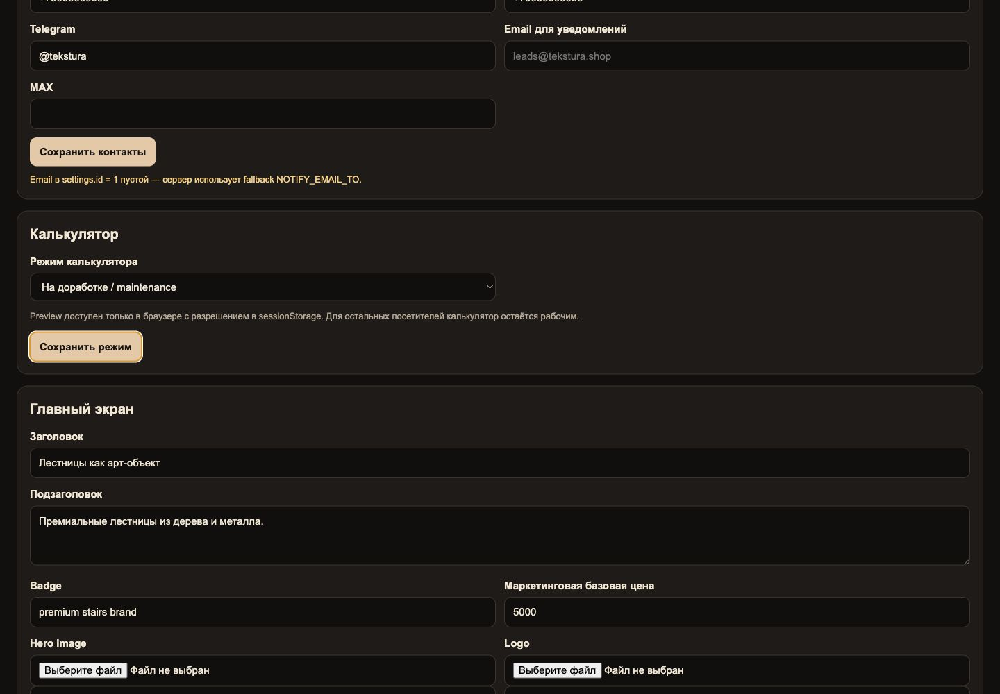

# Управление режимом калькулятора

Режим калькулятора меняется в действующей админке Tekstura:

`/admin/` → **Калькулятор** → **Режим калькулятора**

Настройка хранится в Supabase, в строке `public.settings` с `id = 1`. Файл `content/site.json` больше не управляет режимом калькулятора.

## Доступные режимы

- **Рабочий / production** — посетитель видит обычный калькулятор.
- **На доработке / maintenance** — вместо калькулятора отображается заглушка с возможностью оставить заявку.
- **Preview / тестовый / preview** — тестовый режим доступен только в браузере, где в `sessionStorage` установлен ключ `tekstura_calculator_preview_access` со значением `enabled`. Остальные посетители видят рабочий калькулятор.

## Как изменить режим

1. Откройте `/admin/` и войдите через Supabase Auth.
2. В блоке **«Калькулятор»** выберите значение поля **«Режим калькулятора»**.
3. Нажмите **«Сохранить режим»**.
4. Откройте `/calculator.html` в новой вкладке и проверьте результат.

## Безопасный fallback

Калькулятор всегда переходит в `production`, если:

- Supabase недоступен;
- запрос завершился ошибкой или по таймауту;
- строка настроек или поле `calculator_mode` отсутствует;
- сохранено неизвестное значение.

Защита preview применяется после загрузки настройки: без разрешения в `sessionStorage` значение `preview` не открывает тестовый режим посетителям.
