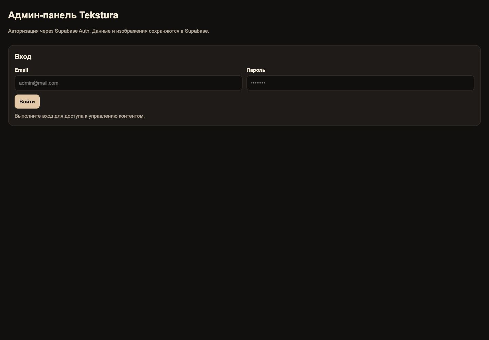
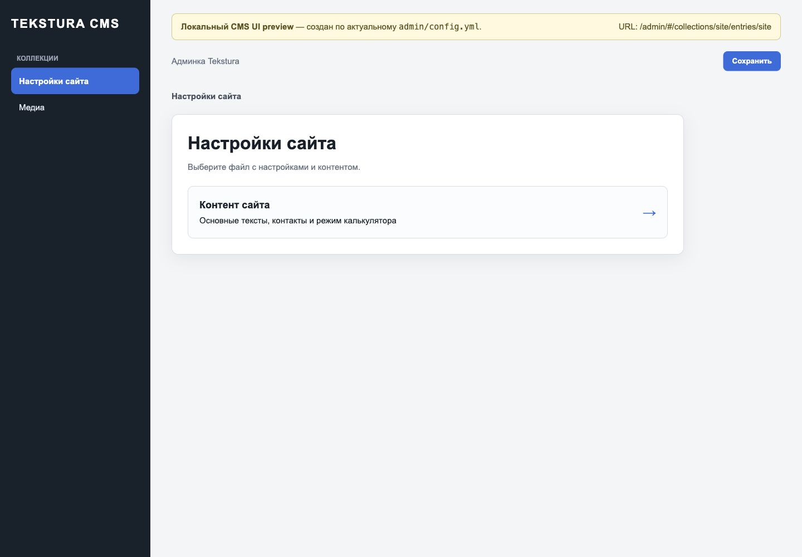
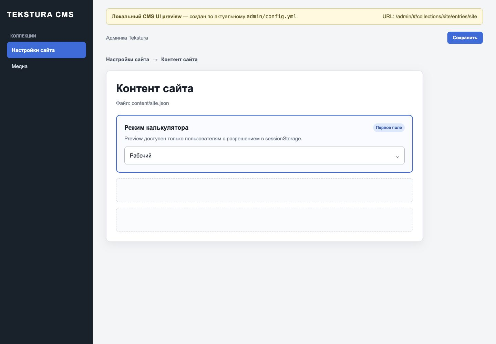
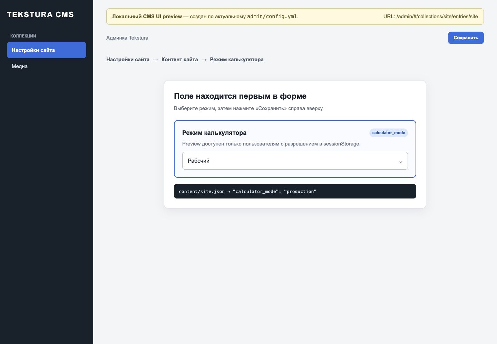
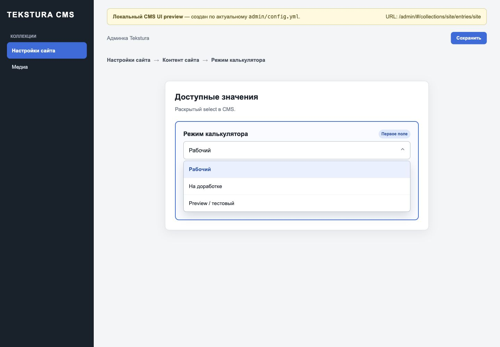

# Управление режимом калькулятора через админку

## Быстрые ссылки

- Админка: [https://tekstura.shop/admin/](https://tekstura.shop/admin/)
- Прямой deep-link к настройке: [https://tekstura.shop/admin/#/collections/site/entries/site](https://tekstura.shop/admin/#/collections/site/entries/site)
- Относительный deep-link: `/admin/#/collections/site/entries/site`

На локальной версии используются те же пути: `http://localhost:<порт>/admin/` и `http://localhost:<порт>/admin/#/collections/site/entries/site`.

## Важное замечание о доступе

Текущий `/admin/` сначала показывает вход через Supabase Auth. Без учётных данных открыть защищённую форму настроек невозможно. Первый скриншот ниже снят с реальной локальной админки. Остальные скриншоты — явно помеченный локальный CMS UI preview, созданный по актуальному `admin/config.yml`; он показывает расположение и состав поля, но не является рабочей админкой.



## Где находится переключатель

Путь в CMS:

**Настройки сайта → Контент сайта → Режим калькулятора**

1. После входа откройте раздел **«Настройки сайта»**.
2. Выберите файл **«Контент сайта»**.
3. Поле **«Режим калькулятора»** находится **первым в форме**.







## Доступные режимы

Раскройте select **«Режим калькулятора»** и выберите одно из значений:

- **Рабочий (`production`)** — посетитель видит обычный рабочий калькулятор.
- **На доработке (`maintenance`)** — посетитель видит maintenance-заглушку и кнопку для заявки.
- **Preview / тестовый (`preview`)** — preview видят только пользователи, у которых в текущей вкладке установлен `sessionStorage`-ключ `tekstura_calculator_preview_access` со значением `enabled`. Для остальных посетителей остаётся production-режим.



## Как сохранить изменение

1. Выберите нужное значение в поле **«Режим калькулятора»**.
2. Нажмите **«Сохранить»** справа вверху.
3. Дождитесь подтверждения сохранения и завершения публикации сайта.
4. Не редактируйте `calculator-mode.js` вручную: режим берётся из настройки сайта.

## Что проверить после сохранения

1. Откройте `/calculator.html` в новой вкладке или обновите страницу без кеша.
2. Для `production` убедитесь, что виден обычный калькулятор.
3. Для `maintenance` убедитесь, что видна заглушка «Калькулятор временно обновляется».
4. Для `preview` откройте калькулятор без preview-доступа и убедитесь, что клиенту показывается production.
5. При необходимости проверить сам preview выполните в консоли этой вкладки:

   ```js
   sessionStorage.setItem('tekstura_calculator_preview_access', 'enabled');
   location.reload();
   ```

6. После проверки удалите временный доступ:

   ```js
   sessionStorage.removeItem('tekstura_calculator_preview_access');
   location.reload();
   ```

## Где хранится настройка в коде

CMS сохраняет выбранное значение в:

```text
content/site.json → calculator_mode
```

Пример рабочего режима:

```json
{
  "calculator_mode": "production"
}
```

Если файл настроек не загрузился или значение неизвестно, калькулятор использует безопасный fallback `production`.
